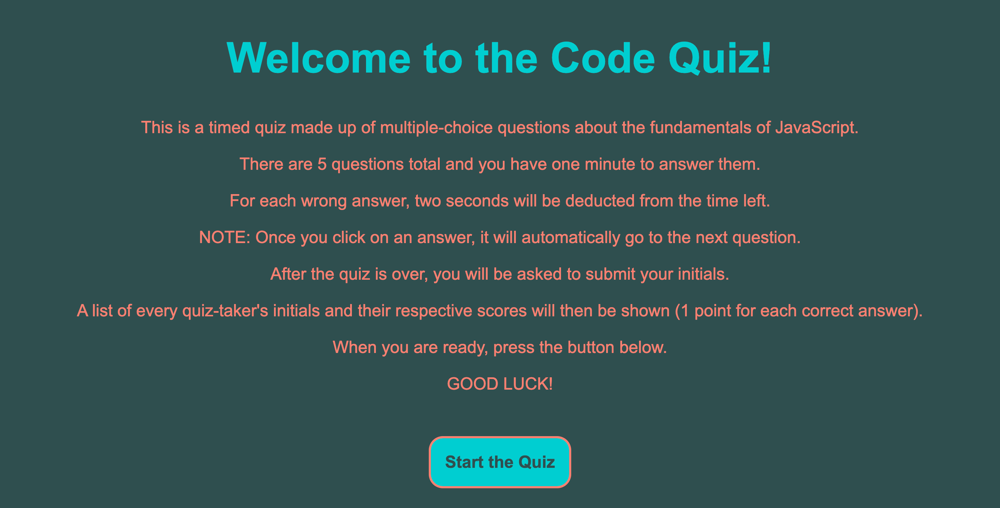
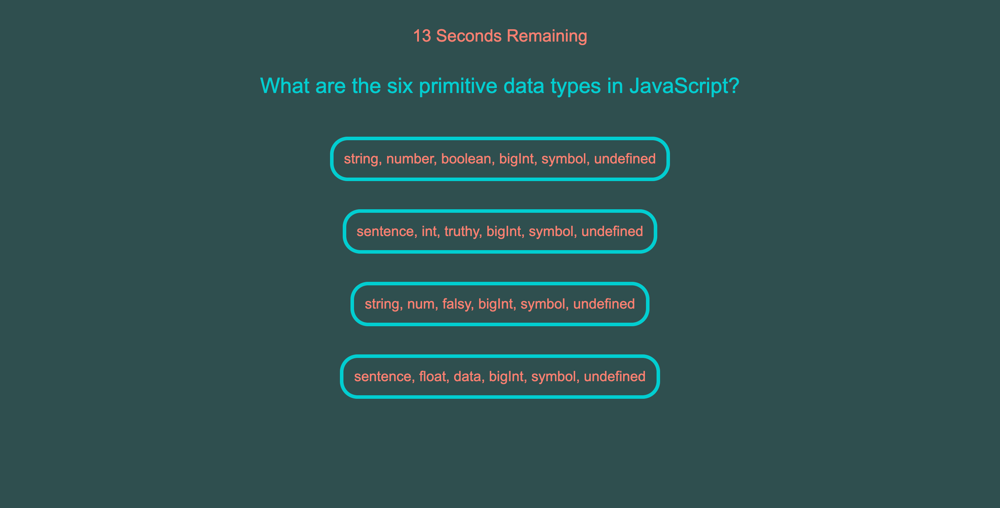
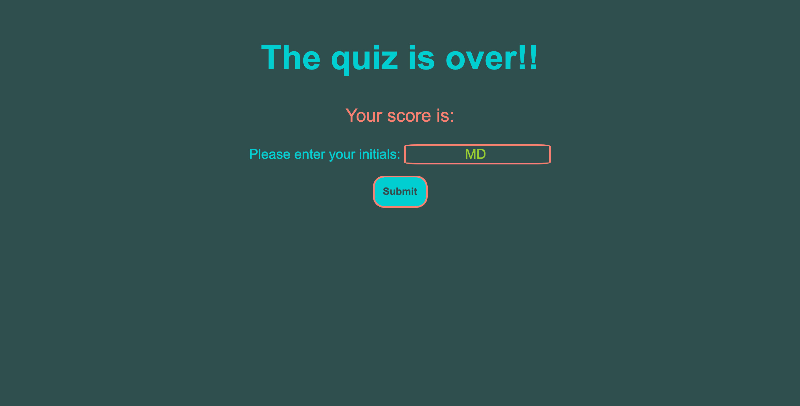
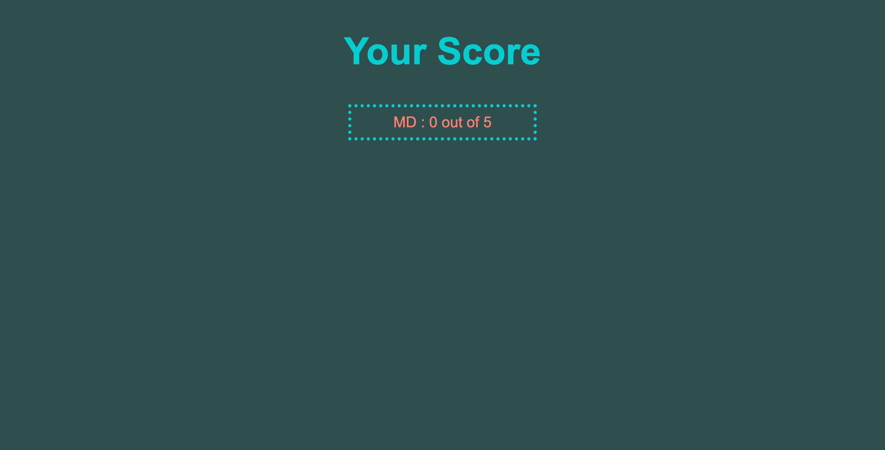

# Code-Quiz

GOAL: 

The goal of this project was to create a timed multiple-choice quiz from scratch. 

The requirements were that, once a button was clicked, the user is presented with the first question, and the timer starts counting down. Once that question is answered, they are presented with the next question. Every time a question is answered incorrectly, time is subtracted from the clock. The quiz is over when the user has answered all of the questions in the time allotted, or the timer reaches 0. Once the quiz is over, the user is prompted to enter their initials, and then their intials and final score are shown. 

These are images of each section of the code quiz website, in order of appearance: 

PROCESS: 

